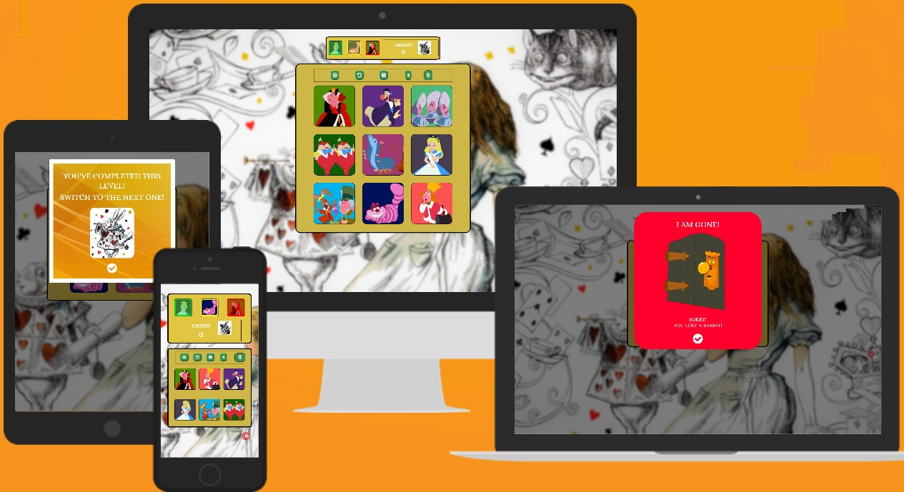
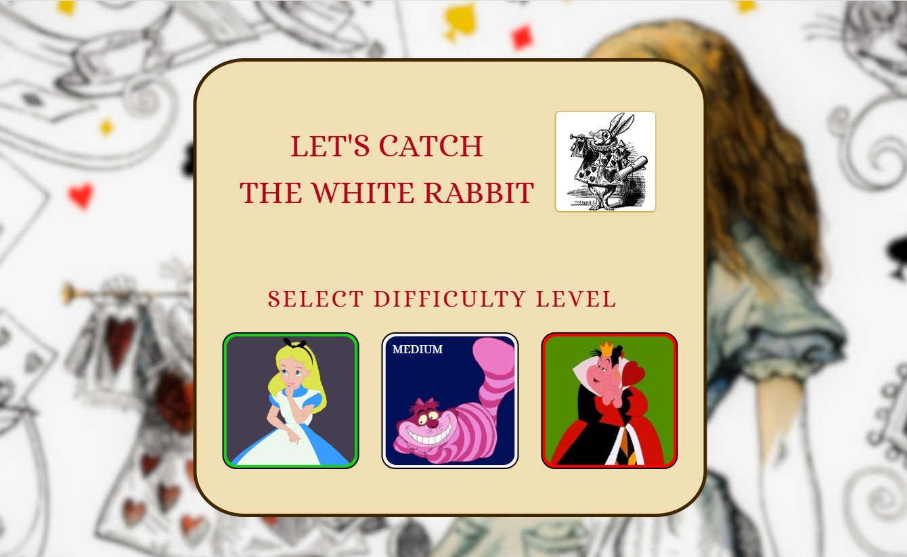
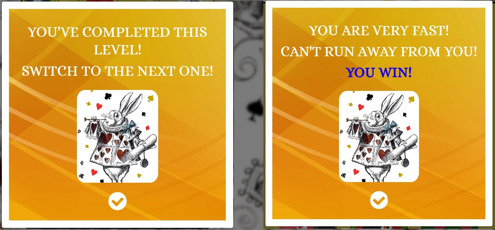

# FOLLOW THE WHITE RABBIT

## MEMORY MATCHING GAME 
#### Interactive Frontend Project

[Follow The White Rabbit - Github Pages link](https://olekst.github.io/Follow-The-White-Rabbit/)

## Table of Contents
1. [**UX**](#ux)
    - [**Goals**](#goals)
    - [**Strategy**](#strategy)
    - [**Scope**](#Scope)
    - [**Structure**](#developer-and-Business-Goals)
    - [**Skeleton**](#skeleton)
    - [**Surface**](#surface)

2. [**Features**](#features)
    - [**Existing Features**](#existing-features)
    - [**Features to be Implemented**](#features-left-to-implement)

3. [**Technologies used**](#technologies-used)

4. [**Testing**](#testing)

5. [**Deployment**](#deployment)
    - [**How to run this project locally**](#how-to-run-this-project-locally)

6. [**Credits**](#credits)
    - [**Content**](#content)
    - [**Images**](#images)
    - [**Audio**](#audio)
    - [**Code**](#code)
    - [**Acknowledgements**](#acknowledgements)

7. [**Disclaimer**](#disclaimer)

## UX

### Goals 

Organizational Goals: 
- Create a simple, easy to play memory game, which can provide a quick relaxation moment.
- The game must be  challenging players with different difficulty levels. 
- The game should be simple, but engaging, with an increasing level of complexity to appeal to people who like challenges and give them fun feeling of overcoming difficulty and achievement. 
- Provide reference to some well recognized characters to attract players' attention.

User Goals: 
- Get a stimulating relaxation break.
- Test & challenge one's memory & attention skills.
- Train one's memory.
- Compete with friends online or offline. 
- Being able to choose appropriate difficulty level, so the game is not too easy & boring, or too difficult & frustrating. 

User Interface: 
- Visually appealing.
- Not too crowded or too colorful.
- With simple, easy to understand navigation.
- Clear objectives, instructions, reactions or prompts where needed. 

Developer's goals: 
- Learn & practice interactive fornt end development, using HTML, CSS, & Javascript/JQuery. 
- A game, which can be potentially used by an online book store, as a fun relaxation break, which can attract more users, and later on used as a promotional tool for new books on this shop, etc. 

### Strategy

Create a memory testing/challening game, which will be fun to play.
Create a simple, easy to use game which provides challenging stimulative interactivity, with increasing difficulty levels. 
Referencing some famous characters to appeal to certain audience. 
Create a game with reference to the characters from Alice in Wonderland, readers of which are smart peope and will be interested  in testing or training their attention & memory skills in a fun way. 

The idea for the game was inspired by:
- Simon says game
- [Visual Memory test from Human Benchmark website](https://humanbenchmark.com/tests/memory)
- "Follow the White Rabbit" from the film Matrix
- Secirity sequence drawn by a finger between 9 or 12 dots on mobile phones
- Some parts/features of the game were insipred by [PicFlip](https://github.com/AJGreaves/picflip) by Anna Greaves, former student of CI. 

### Scope

User Strories:
- School children: I like Alice in Wonderland, and its characters, and I'd love to play "with those chracters". I want a simple easy to undestand game, where I can test my attention and memory skills, by playing with my favourite characters, play together with my friends during a lesson break or over the weekend, and see who is faster. 
- Students: I read the book several times, and now I understand more meanings meant by the author than before, and i really love its storyline, and deeper meaning placed in the characters, their actions in various situations. I'd love to play a fun challening game, which challenges my attantion and tests my memory. It'd be fun also fun to compete with my friends who share the same love for the book. 
- Elder people: I love books and reading. Alice in Wonderlnad has been one of my favourites since young age. I'd be happy to be reminded of the fun mysteries and intricacies of the book, but also keep my attention and memory fit. I'd love a simple easy to understand game, providing good exercises for my brain. 

### Structure

- The main screen will have a slogan: "Follow the white Rabbit", and/or "Catch me if you can", prompt for "How to Play", three screens of difficulty levels with characters from the book: Alice/Easy, The Cheshire Cat/Medium, and The Queen of Hearts/Difficult. 
- How To Play: explains the objective, rules, etc of the game.
- Gameplay screen: will have a number of images with the book's characters. 
        Easy: 4 images
        Medium: 6 images
        Hard: 9 images 
    - Upon pressing "Play", a user will be asked to watch, and by randomly generated sequence, an image of a white rabbit will "run" throung images, drawing a mouse/finger movement sequence across the images (similar to password sequence on mobile phones, so that it feels familiar to users). 
    - A user will be aksed to repeat the sequence by pressing respective images. If it is succesful, a user will be congratulated for "Catching the White Rabbit", otherwise, will be informed that "the rabbit is gone". In Both cases a user will be invited to keep following the rabbit.  
       
- Info modals for won or lost game, finishing a level, completing the game.

### Skeleton

Balsamiq wireframes software was used to create wireframes for this project:
* [Draft of the idea](assets/images/readme/wireframes/JS_Memory_game_draft_idea.pdf)
Shows a mobile view of three different difficulty levels and screen-by-screen seuqence of possible game play. 
* [Main screen + Hard level, computer view](assets/images/readme/wireframes/Main_Screen_Level_web.pdf)
Shows initial game screen and hard level with 9 cards on a computer browser.
* [Main screen + Hard level, mobile view](assets/images/readme/wireframes/Main_Screen_Level_mobile.pdf)

### Surface

Design choices:
- Main introductory screen will have a slogan Let's Catch the White Rabbit", and suggestion to choose a difficulty level, with three (clickable) images representing each level
- Game screens should be as simple as possible, with the focus on the game boards with 4/6/9 cards, which contains all the necessary controls: Play, Reset, Info/Rules, Mute On/Off, Clicks countdown
- Have a player board to show an active difficulty level, where a player will be able to switch between levels.
- The player board will display Score results

Colors: 
- The main colors were chosen based on the colors used in the main background of the whole game. For purposes of not distracting attention, the main background was dimmed and unfocused.
- Images used for game cards are colorful, for this reason everything else was chosen to be dimmed, no bright colors, no multi-colored areas or elements 
- Backgrounds for all the main modals, game boards, buttons, where chosen using [ColorSpace website](https://mycolor.space/).
- The starting color for colour pallette used for backgrounds & other game elements was a color of one card suits on the main background: #c5a304. 

Fonts: 
* Sunshiney & Alice, for resemblance to Alice in Wonderland font used in the Hollywood film. 

Images:
* Images featuring Alice, The Cheshire Cat and other characters were used
* The rabbit is featured on:
- The main modal with slogan "Let's catch the White Rabbit"
- The main background with Alice
- The "running" image
- The score display
- Modal suggesting to level up, shown after gaining 7 points at a level
- Final Win modal, after 7 points gain on the Hard level
* Alice represents the easy level
* The Cheshire Cat - the medium level
* The Queen of Hearts - the hard one

## Features
### Existing Features

Main page has:
- an image of the White Rabbit with the game's slogan - "Let's Catch The White Rabbit", which complements the name of the game "Follow The White Rabbit"
- suggestion to select a difficulty level, represented by three images: 
        - Alice for easy level, 
        - The Cheshire Car - medium
        - The Queen of Hearts - hard
- each image has a coloured border (idea was taken from Anna Greave's student project, PicFlip - see [**Acknowledgements**](#acknowledgements) below:
        - green for easy
        - yellow for medium
        - red for 
- each image has a title (EASY, MEDIUM, or HARD) float on if a mouse is moved over an image, so a player can easily understand which level is which
- each image changes its border color on mouse over so a player knows which image is clickable at the moment
- pressing each of the levels closes the main page modal, and opens the player board with level switch buttons/images, and Score window and game board of 4/6/9 cards
    - on opening a game board the game randomly inserts images into the game cards

Game screen has:
* Player boards at the top:
    - Level switching buttons/images
    - Switching between levels closes a current game board(eg. easy, 4 cards) and opens a target one(eg. medium, 6 cards), also updates the Score to 0
    - Active level image is bright, the other two are dimmed
    - Images change their border color on mouse-over, so a player knows its active to be clicked
    - Score window shows text "CAUGHT 0" & an image of the White Rabbit

* Game board below the player board:
    - Respectively 4/6/9 game cards, which are inactive till Play button is pressed, and Rabbit Run is complete
    - Control buttons right above the cards:
        * Play activates the Rabbit Run, during which the game cards, and reset button are inactive
        * Reset button reshuffles the images in the game cards, preparing for a new game
        * Info button opens a How to Play modal with rules of the game
        * Mute on/off button turns game sounds on & off
        * Clicks Countdown shows how many clicks are left before a game is over 
        * Last click triggers a Win or Lose modal
        * Closing Win modal increases Points by 1
        * Closing Lose modal decreases Points by 1, unless it is 0
        * After gaining 7 points in a game on easy & medium levels, closing Win modal triggers Level Up modal to be displayed, saying that the level has been complete and a plaer can switch to a harder level. *The developer evaluated automated switcing to a higher level on closing the Level Up modal, but decided to leave it for later implementation.*  
        * After gaining 7 points on hard, triggers Final Win modal, saying the White Rabbit cannot run away, and a player won the game.

Win & Lose modals:

<table>
    <tr>
        <td></td>
        <td></td>
        <td></td>
    </tr>
</table>

Level Up & Final Win modals:

* Copyright modal is open by a button located in the right bottom corner of the screen
    - Modal shows info about the developer, link to his Github profile, and disclaimer "for educational purposes only"

* Visual and sound cues:
    * Initial page has three clickable images for choosing a difficulty level, each image has a colour border, with green for easy, yellow for medium, and red for hard
    * Mouse-over or touch on mobile will reveal description for each level: Easy, Medium, Hard
    * Once a level choice image clicked a player is taken to a game board of 4,6,9 cards respectively, a melody is played on the transition from the main page to a game board
    * All the buttons have a mouse-over reaction, so a player can know that a button is active
    * Cards images & level images can be active and inactive. When they are active, a player can get a visual feedback, change of colour, opacity, or border colour
    * On pressing Play, an image of the White Rabbit starts its “run”, sequence of showing at each separate card and creating a pattern
    * Play button is inactive while a player is clicking game cards
    * A melody of appropriate length is played during the Rabbit “Run”, which finish exactly when the Rabbit image disappears from the last card, giving a plyer indication that the “Run” is finished, and he/she can start
    * Cards are inactive(unclickable) during the Rabbit Run, and become clickable once it is finished, it is indicated by colour change of each cards border on mouse-over or touch
    * Click on a card is marked by a click sound, so that a plyer knows that a card has been clicked
    * Clicks Countdown deducts a number at each click, till it is zero, when a win or lose modal is displayed (triggered by the last click)
    * Reset button reshuffles game cards, and resets the Rabbit Run, it is accompanied by a melody
    * Reset button is inactive during Rabbit Run
    * Info button opens a modal with How to Play rules, accompanied by a sound 
    * Mute On/Off has a visual indication of switching between modes, plus when sounds are turned on, the action is accompanied by a click sound
    * Win and Lose modals are displayed with a happy and sad melody respectively
    * Level Up modal is triggered by closing a win modal, when a player achieved 7 points, accompanied by a melody
    * Final Win modal, is triggered by closing a win modal, when a player achieved 7 points on Hard level, accompanied by the happiest melody
    * Closing of each modal is accompanied with a click sound
    * Opening and closing a footer is accompanied with a click sound

### Features to Implement in the Future

* Automated level switching on completing a level, i.e. gaining 7 points on easy or medium level, i.e. on closing Level Up modal.

## Technologies Used
- This project is built using HTML, CSS & JavaScript programming languages.
- [JQuery](https://jquery.com) to simplify DOM manipulation
- [Gitpod](https://gitpod.io/) for coding the project.
- [GitHub](https://github.com/) to store & share the project's code. 
- [ChromeDevtools](https://developers.google.com/web/tools/chrome-devtools) to check created code and possible inconsistences, find best parameters for various code items. 
- [Bootstrap](https://www.bootstrapcdn.com/) to simplify website's structure. 
- [FontAwesome](https://www.bootstrapcdn.com/fontawesome/) for button icons.
- [Google Fonts](https://fonts.google.com/) for fonts.
- [AutoPrefixer](https://autoprefixer.github.io/) to make sure css prefixes cover all browser versions.
- [Am I responsive](http://ami.responsivedesign.is/) was used to check responsiveness of the website for various screen sizes - mobile, tab, laptop, desktop.
- [Balsamiq](https://balsamiq.com/) was used to create wireframes.
- [ColorSpace](https://mycolor.space/) for matching colors

## Testing
Testing information can be found in separate [Testing.md](Testing.md) file.

## Deployment

[GitHub Pages Website](https://olekst.github.io/Follow-The-White-Rabbit/)

Gitpod was used to code this project. It was then committed and pushed to Github using the command line and deployed on GitHub pages from the repository.

In order to deploy the site, firstly I logged into GitHub Pages. Following this I chose OlekSt/User-Centric-Frontend-Milestone-Project-1 and then clicked on ‘Settings’. I then scrolled down to ‘Github Pages’ and changed the ‘Source’ to ‘master branch’. From this, the page automatically refreshed and I scrolled up and found the link to the deployed website. 

### Running the project locally

In order to clone this project, it is necessary to follow these steps:

1. Go to the [Project Repository](https://olekst.github.io/Follow-The-White-Rabbit/).
2. Click 'Clone or Download'.
3. In the Clone with HTTPs section, click he clone URL for the repository.
4. Open the Terminal and change the working directory to the location where you want the cloned directory to be made.
5. Type git clone, and then paste the URL you copied in Step 2.

$ git clone https://github.com/YOUR-USERNAME/YOUR-REPOSITORY

6. Press Enter.

These instructions were taken from the following link: [Cloning a Repository](https://help.github.com/en/articles/cloning-a-repository).

### Credits

#### Content
The website is created by Alexey Statsenko, using the media described below. 

#### Media

#### Images
- Main background image, B&W & colored images of the white rabbit were downloaded from a blog of [Pan Macmillan UK publishing house](https://www.panmacmillan.com/). 
- Images for game cards, win, lose modals were downloaded from [Jose Avalos' website](https://www.tumbex.com/josepeacock.tumblr/posts). 

#### Audio
- All audio files were downloaded from [Free Sound Library](https://www.freesoundslibrary.com/).

#### Code
- Main modal code was copied from [Code Lab](https://www.tutorialrepublic.com/codelab.php?topic=faq&file=show-bootstrap-modal-on-page-load).
- Code for other modals was copied from [W3Schools](https://www.w3schools.com/bootstrap/bootstrap_modal.asp).
- JSON.stringify code taken from here [Atta-Ur-Rehman Shah's website](https://attacomsian.com/blog/javascript-compare-arrays#).
- Mute On/Off function code is taken from [Anna Greaves game's page](https://github.com/AJGreaves/picflip).

#### Acknowledgements
1. Stephen Moody, CI tutor for shorting out the code for Rabbit Run/rabbit image moving across cards/, and other advice. 
2. Tim Nelson, CI tutor for helping with Rabbit Run code.
3. Anna Greaves, CI tutor for the Picflip game, where I got inspiration for some features of my game (described in this file above througout the text), as well as ideas for structuring Readme.md & Testing.md. 
4. My mentor, Adegbenga Adeye, for advice and help with planning and creating the website; checking the project and giving advice during the project's calls - checking the code, fixing problems, giving general advice how to organize the website in a better way.
5. My firends Katja, Nafeesah, Mario, Kasia, Chris, Candice for playing/testing the game and giving me feedback on possible improvements. 

#### Disclaimer
The content of this website, including the images used, are for educational purposes only.