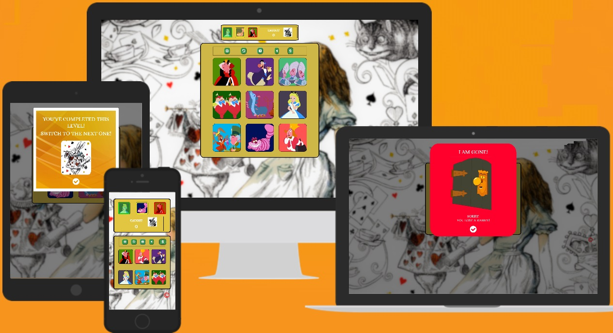

# FOLLOW THE WHITE RABBIT - Testing
## MEMORY MATCHING GAME - Testing
#### Interactive Frontend Project - Testing write-up

This document is intended to record testing at various stages of development of the project, as well as different functions, functionalities, correct display of the project's page, etc. 

[Main README.md file](README.md)

[View website in GitHub Pages](https://olekst.github.io/Follow-The-White-Rabbit/)

## Memory Game 

1. [**Automated Testing**](#automated-testing)
    - [**Validation services**](#validation-services)
2. [**Client Stories Testing**](#client-stories-testing)
3. [**Manual Testing**](#manual-testing)
    - [**Testing undertaken on laptop**](#testing-undertaken-on-laptop) 
    - [**Testing undertaken mobile and pad devices**](#testing-undertaken-on-mobile-and-pad-devices)
    - [**Testing undertaken in DevTools**](#testing-undertaken-in-DevTools)
4. [**Bugs discovered**](#bugs-discovered)
    - [**Solved bugs**](#solved-bugs)
    - [**Unsolved bugs**](#unsolved-bugs)
5. [**Further Testing**](#further-testing)

## Automated Testing

### Validation services
The following validation services were used to check the validity of the website code.
- [W3C Markup Validation]( https://validator.w3.org/) was used to validate HTML
    Three errors: lines 49, 56, 63; due to "div" being a child of "dfn". Left the errors unfixed due to being unable to find fast solution to keep functionality of floating in level names (Easy, Medium, Hard) on mouse over on level choice images on the main page. 
- [W3C CSS validation](https://jigsaw.w3.org/css-validator/) was used to validate CSS.
    No errors, some warnings.
- [JSHint](https://jshint.com/) was used to validate JavaScript.
    No errors, some warnings.
- [Am I responsive](http://ami.responsivedesign.is/) was used to check responsiveness of the website for various screen sizes - mobile, tab, laptop, desktop. 

## Client stories testing

The user stories are described in the UX section of [README.md](README.md)

**As a player, I want:**

1.	Clear goal for the game
    * The initial page displays a slogan “Let’s Catch the White Rabbit”, which complements the name of the game “Follow the White Rabbit”
    * Difficulty level choice is suggested on the main page, with three images of Alice, The Cheshire Cat, & the Queen of Hearts, representing easy, medium and hard levels
    * Mouse-over on computers and press on mobile/tab pops up a difficulty level Name over the level image, in case a player is confused

2.	Clear instructions how to play
    * The name of the game, and the main page slogan clearly state that we will be following the White Rabbit
    * Each game board (4 / 6 / 9 cards) has an info button, which opens a modal with “How To Play” instructions
    * A suggested number of points per level is 7, and once a player reaches 7 points on Easy & Medium, a modal will inform that the player has completed a level, and is ready to move up
    * When a player has reached 7 points on Hard, a modal will inform that the player has won the game
    * Each level is also marked by colour, with green for easy, yellow for medium, and red for hard

3.	Have all the necessary control buttons & info in one place
    * The main page provides difficulty level choice
    * The player board (on the game boards section) shows level buttons, with a current level visually differentiated, where a player can switch between levels
    * All the necessary buttons to control a game – Play, Reset, Info, Mute On/Off, plus Clicks countdown – are placed right above game cards on each of the game boards with respectively 4,6,9 cards
    * Clicks countdown shows how many clicks left for a player at each game, as a player has to click cards 4,6,9 times for a game to be completed
    * A player can reset a game, and start Rabbit Run over by pressing Play, in case he/she missed the Rabbit Run sequence, or clicked cards incorrectly. This won’t affect points.
    * A point is given for each correctly complete game, a point is taken away for each incorrectly complete game, level is completed by achieving 7 points
    * Score is displayed next to the level switching buttons, right above the game boards with cards

4.	Ability to choose difficulty level, and go from easy to harder
    * Levels can be chosen on the initial page, where they have clear descriptions, and colour differentiation, green for easy, yellow for medium, and red for hard
    * During the game a player can switch between levels by using level buttons on the player board, placed right above the game boards with cards

5.	Visual or audio feedback to my actions
    * Initial page has three clickable images for choosing a difficulty level, each image has a colour border, with green for easy, yellow for medium, and red for hard
    * Mouse-over or touch on mobile will reveal description for each level: Easy, Medium, Hard
    * Once a level choice image clicked a player is taken to a game board of 4,6,9 cards respectively, a melody is played on the transition from the main page to a game board
    * All the buttons have a mouse-over reaction, so a player can know that a button is active
    * Cards images & level images can be active and inactive. When they are active, a player can get a visual feedback, change of colour, opacity, or border colour
    * On pressing Play, an image of the White Rabbit starts its “run”, sequence of showing at each separate card and creating a pattern
    * Play button is inactive while a player is clicking game cards
    * A melody of appropriate length is played during the Rabbit “Run”, which finish exactly when the Rabbit image disappears from the last card, giving a player indication that the “Run” is finished, and he/she can start
    * Cards are inactive(unclickable) during the Rabbit Run, and become clickable once it is finished, it is indicated by colour change of each cards border on mouse-over or touch
    * Click on a card is marked by a click sound, so that a player knows that a card has been clicked
    * Clicks Countdown deducts a number at each click, till it is zero, when a win or lose modal is displayed (triggered by the last click)
    * Reset button reshuffles game cards, and resets the Rabbit Run, it is accompanied by a melody
    * Reset button is inactive during Rabbit Run
    * Info button opens a modal with How to Play rules, accompanied by a sound 
    * Mute On/Off has a visual indication of switching between modes, plus when sounds are turned on, the action is accompanied by a click sound
    * Win and Lose modals are displayed with a happy and sad melody respectively
    * Level Up modal is triggered by closing a win modal, when a player achieved 7 points, accompanied by a melody
    * Final Win modal, is triggered by closing a win modal, when a player achieved 7 points on Hard level, accompanied by the happiest melody
    * Closing of each modal is accompanied by a click sound
    * Opening and closing a footer is accompanied by a click sound

6.	Positive/negative feedback for won/lost rounds, completed level/game
    * Gaining a point is shown by a Win modal with an encouraging message, positive melody, and adding a number to a Score window
    * Losing a point is shown by a Lose modal with a sad message and melody, and deducting a number from the Score
    * Win and Lose modals are displayed with a happy & sad melody respectively
    * Level Up modal is triggered by closing a win modal, when a player achieved 7 points, accompanied by a melody
    * Final Win modal, is triggered by closing a win modal, when a player achieved 7 points on Hard level, accompanied by the happiest melody

## Manual testing
The section described in detail all the steps taken to confirm all the elements of the website work as intended. 
Tested on:
- laptop
- desktop window of [Am I Responsive](https://amiresponsive.co.uk/)
- pad mode on a laptop
- mobile phone
- Chrome Developer Tools device simulators on all options

### Testing undertaken on laptop; and desktop version of [Am I Responsive](https://amiresponsive.co.uk/)
The game was tested on Lenovo Yoga 530, in Google Chrome, Mozilla Firefox, & Microsoft Edge

1. The main page screen:
- Confirmed that each level images has a description (Easy, Medium, Hard) floating in on mouse-over
- Confirmed that each level image's border changes colour from green, yellow, red to white on mouse-over, and back to green, yellow, red on mouse out

2. Game boards screen:
*The process is the same for all 3 difficulty levels, I have combined them for saving space, and not creating too much duplicate text. Differences for 4 / 6 / 9 cards are clearly marked in this section below.*

* Easy / Medium / Hard levels:

- Melody played on transition from the main to level page
- Cards are inactive on mouse-over
- Clicks countdown shows "4" / "6" / "9"
- Green controls buttons change colour on mouse over, meaning all active
- Level button are changing border color on mouse over
- Current easy level image is bright, other two - medium, hard - dimmed, or
        medium is bright, and easy, hard - dimmed, or
        hard is bright, and easy, medium - dimmed
- Score shows "CAUGHT 0"
- Clicking on Play button, launches Rabbit Run, accompanied by the appropriate melody
- Reset button is blocked for the duration of the melody
- Game cards are inactive
- Once the Run & the melody stop, Play button deactivates, game cards & Reset button activate
- Each card click decreases the number in Clicks Countdown by 1, also accompanied by a sound, till it reaches 0, when a lose or win modal is triggered
- Clicking Reset button reshuffles images in the game cards, and re-activates the Play button, accompanied by the appropriate melody
- Each correct player's sequence adds a point to the Score and displays the Win modal with a positive melody
- Each wrong player's sequence deducts a point from the Score (unless it was 0) and displays the Lose modal with a sad melody
- Reaching 7 points triggers a Level Up modal with bell notification sound, informing that a player has completed the level, and can go a level up
- Info modal with How to Play rules is opened by clicking the info button accompanied by a respective melody
- Copyright modal is opened by clicking a Copyright symbol button at the right down bottom of the screen, accompanied by a click sound
- Closing any modal is accompanied by a click sound
- Mute Off/On button changes icon on click, showing "sound" when muted, and "muted" when sounds are on. Unmuting all sounds is accompanied by a click sound. 
- Switching between levels works, and switches between game boards with 4 - 6 - 9 cards, while player boards with level switching buttons and score window stays the same. 
- On switching levels Score is updated to 0, and visual effects showing active-inactive level change to show which level is currently active.
- Went through all the levels to confirm: 
    - all cards make click sounds
    - after each click Countdown number decreases
    - each correct sequence displays the Win modal
    - after 7 points, Level Up modal is displayed 
    - after 7 points on Hard the Final Win modal is displayed 
    - all modals with respective melodies
    - everything works as intended

### Testing undertaken mobile and pad devices
The game was tested on Samsung A7 & Lenovo Yoga 530 in Pad mode, Google Chrome, Microsoft Edge & Mozilla Firefox

1. The main page screen:
- Confirmed that each level images has a description (Easy, Medium, Hard) floating in on touching a level image
- Confirmed that each level image's border changes colour from green, yellow, red to white on touching a level image, and back to green, yellow, red on touching somewhere else on screen

2. Game boards screen:
*The process is the same for all 3 difficulty levels, I have combined them for saving space, and not creating too much duplicate text. Differences for 4 / 6 / 9 cards are clearly marked in this section below.*

* Easy / Medium / Hard levels:

- Melody played on transition from the main to level page
- Cards are inactive on touch
- Clicks countdown shows "4" / "6" / "9"
- Green controls buttons change colour on touch, meaning all active
- Level button are changing border color on touch, 
- Current easy level image is bright, other two - medium, hard - dimmed, or
        medium is bright, and easy, hard - dimmed, or
        hard is bright, and easy, medium - dimmed
- Score shows "CAUGHT 0"
- Clicking on Play button, launches Rabbit Run, accompanied by the appropriate melody
- Reset button is blocked for the duration of the melody
- Game cards are inactive
- Once the Run & the melody stop, Play button deactivates, game cards & Reset button activate
- Each card click decreases the number in Clicks Countdown by 1, also accompanied by a sound, till it reaches 0, when a lose or win modal is triggered
- Clicking Reset button reshuffles images in the game cards, and re-activates the Play button, accompanied by the appropriate melody
- Each correct player's sequence adds a point to the Score and displays the Win modal with a positive melody
- Each wrong player's sequence deducts a point from the Score (unless it was 0) and displays the Lose modal with a sad melody
- Reaching 7 points triggers a Level Up modal with bell notification sound, informing that a player has completed the level, and can go a level up
- Info modal with How to Play rules is opened by clicking the info button accompanied by a respective melody
- Copyright modal is opened by clicking a Copyright symbol button at the right down bottom of the screen, accompanied by a click sound
- Closing any modal is accompanied by a click sound
- Mute Off/On button changes icon on click, showing "sound" when muted, and "muted" when sounds are on. Unmuting all sounds is accompanied by a click sound. 
- Switching between levels works, and switches between game boards with 4 - 6 - 9 cards, while player boards with level switching buttons and score window stays the same. 
- On switching levels Score is updated to 0, and visual effects showing active-inactive level change to show which level is currently active.
- Went through all the levels to confirm: 
    - all cards make click sounds
    - after each click Countdown number decreases
    - each correct sequence displays the Win modal
    - after 7 points, Level Up modal is displayed 
    - after 7 points on Hard the Final Win modal is displayed 
    - all modals with respective melodies
    - everything works as intended

### Testing undertaken in DevTools
The game was tested on all devices available there following the same procedure described in the section above for testing on a laptop, tab & mobile 

### Bugs discovered: 

#### Solved bugs:
1. Random images generation and insertion into game cards.
    Functionality has been tested and the function generates a random set of 4/6/9 cards and adds them as children into card-game divs. 
    Function is called by a click on Easy-, Medium-, Hard- level image on the initial page.
    A player is taken to a game page with 4-6-9 cards, and each time a random (non repetitive) set of cards is displayed on a game board.

2. Random generation of White Rabbit Image "run" across game cards of chosen level of complexity - 4/6/9 cards.
    The function generates a random set of cards (different from Random images, point 1 above) where White Rabbit image is to be displayed at each game card, one after another, creating a random "run" pattern, 
    The bug: White Rabbit image replaces game card image, and is displayed on each card according to randomly generated patters, but it happens too fast for a player to see it. 
    - Contacted tutor-support, a tutor helped to partly solve the problem, but the "run" is still not visible.
    - Booked a screen one-on-one session.
    BUG: Images are inserted with delay and blue background is visible for a split-second in some cards. 

3. Capture of players' clicks and comparison to randomly generate White Rabbit "run" pattern
    Testing on all difficulty level boards:
    BUG: Incorrect RabbitRun returns both Win and Lost messages.
    Corrected the code for rabbitRun & followRaabit, tested clicking through all three difficulty levels, both correct and wrong set of clicks, at least 6 times each, now works correctly. 

4. Clicks Countdown
    Each board will have a counter of clicks starting at 4/6/9 and decreasing at each click, so that a player knows how many clicks left.
    Tested clicks across three difficulty levels. Works correctly. 
    BUG: If reset button is pressed before Play Button for Rabbit Run after loading from the main screen, "Clicks left" shows "undefined" instead of 4/6/9.
        Fixed. 
    BUG: Wrong number of clicks left after choosing a level from the initial page - 4 clicks for all the boards. Working correctly on reset button and level switching.
        Fixed.

5. Win-Lose modal
    Added modals for both cases. Tested, works correctly: Win Modal in case a player repeated the Rabbit's run correctly, and Lose modal if otherwise. 

6. Reset Function
    Added a reset function, which should reset all the game cards, rabbit's run pattern and generate a new set of random images, and insert them into game cards on respective level.
    BUG: The function does not work properly, does not insert full amount (4 or 6 or 9) cards, and then crashes, with a warning message in Developers Tools Console.
    - The function is supposed to remove all the images inserted as children elements, generate randomly a new set of cards, and insert them into cards for a new game. The function returns a null for some of the images, sometimes after correctly inserting 1 or 2 images. 
    Fixed: reset function works upon clicking modal button close, inserts new set of images into game cards, and Play button is re-launches the Rabbit Run across cards.
    
    BUG: If reset button(on game board) is pressed while Rabbit Run, inserted images are added on top of each in one cards, some cards have no images.
    Fixed: Blocked reset button for the period of time it takes to complete Rabbit Run on each diff.level board

7. Switching  between difficulty levels on player info board
    BUG: If a game is played on of the boards, and then levels switched, the Clicks left number does not get updated according to a board switched to, keeps showing the number from a board where last game was played.
    The bug is fixed.
    BUG: If button Play is pressed, but no cards are played, button Play stays inactive, and if you switch between levels, and come back to the level where Play was pressed, it is still inactive.
    Fixed. 
    BUG: Added opacity to level images in player board to show which level is active. Does not change opacity correctly. Show correct active level only after second click on level image/button in player board.
    Fixed.

#### Unsolved bugs:
1. On mobile
    BUG: Touch on level choice images, control buttons, level switching images opens right-click menu of a browser, while showing necessary visual info of the game. 

2. Mute On/Off button.
    BUG: On Mute off mode the button does not show FontAwesome icon properly. 

3. Errors in html reported on lines 49, 56, 63 due to "div" being a child of "dfn". Left the errors due to being unable to find fast solution to keep functionality of floating in level names (Easy, Medium, Hard) on mouse over on level choice images on the main page. 

## Further testing: 
1. Asked friends and family to look at the site on their devices & report any issues they found.
